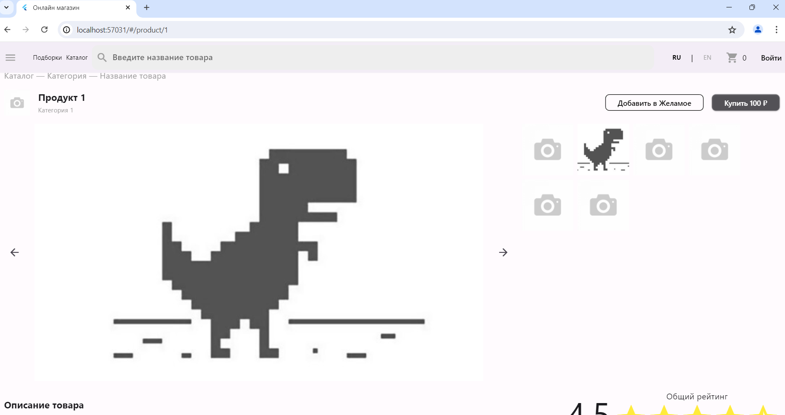

# online_store

Реализована небольшая часть интернет магазина, которая представлять из себя общий каталог товаров и карточку одного товара, которая открываться при переходе из общего каталога.

## Использованные ресурсы и пакеты

В этом проекте использовались такие ресурсы и пакеты как:

- [flutter_bloc: ^8.1.3](https://pub.dev/packages/flutter_bloc)
- [json_annotation: ^4.8.1](https://pub.dev/packages/json_annotation)
- [freezed: ^2.4.1](https://pub.dev/packages/freezed)
- [dio: ^5.3.3](https://pub.dev/packages/dio/versions)
- [carousel_slider: ^4.2.1](https://pub.dev/packages/carousel_slider)
- [go_router: ^13.2.2](https://pub.dev/packages/go_router/versions)
- [build_runner: ^2.4.6](https://pub.dev/packages/build_runner)
- [json_serializable: ^6.7.1](https://pub.dev/packages/json_serializable)

## Запуск debug
Для корректного отображения при просмотре debug в хроме следует ввести команду:
```html
flutter run -d chrome --web-renderer html
```
___
## Экраны проекта
### Desktop Web
#### Каталог Desktop


___


___
#### Продукт Desktop


___
### Mobile Web
#### Каталог Mobile


___


___
#### Продукт Mobile


___